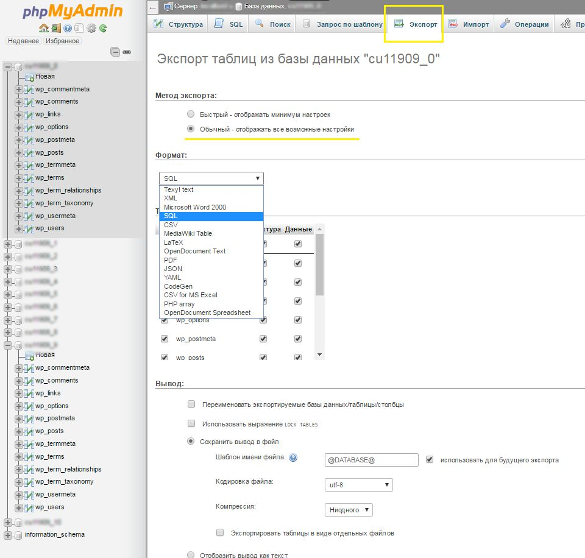
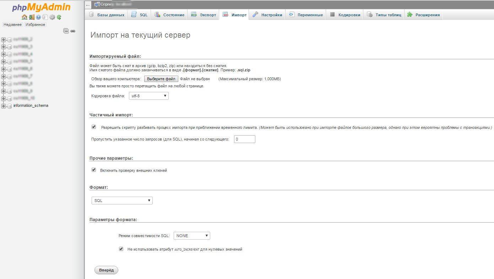

# Как импортировать и экспортировать базы данных в MySQL или MariaDB
Управление базами данных — важная часть в администрировании Linux-серверов и веб-приложений. Как минимум, любой уважающий себя разработчик должен уметь создавать бекапы и восстанавливать базы данных. В этой статье будет рассмотрен **импорт и экспорт баз данных MySQL и MariaDB**. Это может понадобиться для создания или загрузки дампов — для переноса приложения на другой сервер или бекапа данных.

Для того, чтобы выполнить дальнейшие шаги, вам нужен будет Linux-сервер (в инструкции все действия выполняются на Ubuntu). Арендовать виртуальный сервер вы можете у нас по [этой ссылке](https://timeweb.cloud/my/servers/create).

## Работа с базой данных
MySQL и MariaDB — это популярные реляционные СУБД, которые используются для хранения данных больших приложений.

MariaDB – это модифицированная версия MySQL. Сервис MariaDB был создан первоначальной командой разработчиков MySQL из-за проблем с лицензированием и распространением после того, как базу данных MySQL приобрела корпорация Oracle. С момента приобретения MySQL и MariaDB развивались по-разному. Несмотря на это, MariaDB использует файлы данных и определений таблиц MySQL, а также идентичные клиентские протоколы, клиентские API, порты и сокеты.

Так что создание базы данных у них сильно не отличаются. Вам необходимо будет зайти в MySQL или MariaDB как root или другой пользователь с повышенными привилегиями: `mysql -u root -p` или `mariadb -u root -p`.

Для создания базы данных используйте синтаксис SQL: `CREATE DATABASE IF NOT EXISTS <имя базы данных>;` (буквально: создать базу данных если не существует).

Для просмотра существующих баз данных можно использовать команду `SHOW DATABASES;`.

Для переключения на нужную базу данных выполните `USE <имя базы данных>;`. После вы можете просмотреть существующие таблицы через `SHOW TABLES;`.

Некоторые полезные команды вы можете увидеть ниже:

 + `CREATE TABLE IF NOT EXISTS users (user_id INT NOT NULL PRIMARY KEY AUTO_INCREMENT, username VARCHAR(100) NOT NULL);` — создает таблицу users с полями user_id и username.
 + `INSERT INTO users (username) VALUES ('John Doe');` — вставляет в таблицу users новую колонку.
 + `SELECT * FROM users;` — выборка всех записей из таблицы users.

Статистику по работе сервера можно получить через `SHOW GLOBAL STATUS;`. 

## Экспорт
**Экспорт данных MySQL и MariaDB** отличается от импорта тем, что используется утилита `mysqldump`. Консольная утилита mysqldump позволяет экспортировать данные в SQL-файл, с которым можно легко работать. Для этого вам понадобится имя базы данных, а также пользователь, у которого есть как минимум право на чтение базы данных.

Сама команда следующая:

```bash
mysqldump -u <имя пользователя> -p<пароль> <имя базы данных> > data-dump.sql
```

Где:
 
 + `-p<пароль>` — пароль от пользователя (в ручном виде), или можете использовать просто `-p` (автоматически запросит пароль);
 + `data-dump.sql` — файл дампа базы данных;
 + `<имя пользователя>` — имя привилегированного пользователя (права на чтение);
 + `<имя базы данных>` — имя базы данных.

Также можно создавать дампы удаленно, с флагом -h:

```bash
mysqldump -h <ip-адрес> -u <имя пользователя> -p<пароль> <имя базы данных> > data-dump.sql # если MySQL сервер на стандартном порту
# ИЛИ
mysqldump -h <ip-адрес> -P <порт> -u <имя пользователя> -p<пароль> <имя базы данных> > data-dump.sql # если MySQL на нестандартном порту
```

Флаг -h используется для указания адреса удаленного сервера MySQL, с который вы хотите создать дамп базы данных. Также можно использовать флаг -P для указания порта сервера.

Аналогично с импортом, выводятся только ошибки. Вы можете проверить корректность экспортируемых данных, чтобы убедиться в том, что процедура прошла успешно. В итоге вы успешно проведете **экспорт таблиц MySQL**.

В документе будет указано название базы данных (MySQL или MariaDB), ее название и другие данные.

## Импорт данных
Для **импорта дампа базы данных в MySQL** мы будем использовать следующую команду:

```bash
mysql -u <имя пользователя> -p<пароль>  <имя новой базы данных> < data-dump.sql
```

Где:

 + `-p<пароль>` — пароль от пользователя (в ручном виде), или можете использовать просто `-p` (будет запрошен пароль автоматически);
 + `data-dump.sql` — файл дампа базы данных;
 + `<имя пользователя>` — имя привилегированного пользователя (права на запись);
 + `<имя новой базы данных>` — имя новой базы данных в которую мы импортируем дамп.

Если команда выполнена корректно, то вывода не будет. В ином же случае могут отобразиться сообщения об ошибках или предупреждениях. Проверить правильность импорта можно через следующие команды MySQL:

```bash
SHOW DATABASES; # покажет базы данных
USE <БАЗА ДАННЫХ>; # переходим в базу данных
SHOW TABLES; # покажет таблицы в базе данных
```

## systemD-служба для бекапа
Допустим, вы хотите автоматизировать процесс бекапа (экспорта) базы данных. Мы будем использовать службу-таймер, которая будет запускать скрипт для бекапа.

 > Timer — это механизм для планирования выполнения конкретной службы в заданное время или через определенные интервалы.

Для этого подключитесь к серверу и выполните следующие команды:

```bash
mkdir -p /usr/bin/backup_scripts # создаем директорию, где будут храниться скрипты для бекапа
```

После создайте и откройте файл `/usr/bin/backup_scripts/mysql_backup.sh` через любой редактор (например nano) и запишите в нем следующее:

```bash
TIMESTAMP=$(date +'%F') # получаем текущую дату
BACKUP_DIR='<путь до директории, где будут сохраняться дампы>'
MYSQL_USER='<имя пользователя>'
MYSQL_PASSWORD='<пароль пользователя>'
DATABASE_NAME='<название базы данных>'

mkdir -p '$BACKUP_DIR/$TIMESTAMP' # создаем директорию
mysqldump -u $MYSQL_USER -p$MYSQL_PASSWORD $DATABASE_NAME > '$BACKUP_DIR/$TIMESTAMP/$DATABASE_NAME-$TIMESTAMP.sql' # создаем дамп
find '$BACKUP_DIR;' -type d -mtime +28 -exec rm -rf {} \; # удаление бекапов старше 4 недель
```

Далее выдадим этому скрипту права на исполнение:

```bash
chmod +x /usr/bin/backup_scripts/mysql_backup.sh
```

Следующим шагом будет создание службы и таймера systemD:

1. Создайте файл службы (`/etc/systemd/system/mysql-backup.service`)

```
[Unit]
Description=MySQL Database Backup Service

[Service]
Type=oneshot
ExecStart=/usr/bin/backup_scripts/mysql_backup.sh

[Install]
WantedBy=multi-user.target
```

2. Создайте файл таймера (`/etc/systemd/system/mysql-backup.timer`):

```
[Unit]
Descripton=Run MySQL Backup Service Weekly

[Timer]
OnCalendar=weekly
Persistent=true

[Install]
WantedBy=timers.target
```

Конечным действием является активация службы и таймера:

```bash
systemctl daemon-reload # перезагрузка конфигурации systemD
systemctl enable mysql-backup.timer # включаем таймер в автозагрузку
systemctl start mysql-backup.timer # запуск таймера
```

После проверьте статус службы:

```bash
systemctl status mysql-backup.timer
systemctl list-timers
```

Готово! Теперь каждую неделю будет создаваться дамп нужной вам базы данных.

## Экспорт и импорт через phpMyAdmin
Операции **импорта и экспорта баз данных MySQL/MariaDB** можно делать не только через терминал, а также через веб-интерфейс phpMyAdmin. Некоторым этот способ может показаться даже легче и удобнее. Но при импорте и экспорте больших дампов (например, больше 1 гигабайта) могут наблюдаться проблемы. 

В этой секции будет рассматриваться поверхностный импорт и экспорт базы данных, больше вы можете найти [на нашем официальном сайте](https://timeweb.com/ru/docs/virtualnyj-hosting/bazy-dannyh/osnovy-raboty-v-phpmyadmin/).

### Экспорт
Для экспорта перейдите в нужную базу данных, выберите вкладку «Экспорт» и, в зависимости от своих предпочтений, быстрый или обычный метод экспорта. Второй подойдет для тех, кто хочет самостоятельно выставить все настройки.



При быстром экспорте соблюдайте следующие шаги:

1. В области слева выберите необходимую базу данных (должен раскрыться список таблиц базы данных).
2. Перейдите на вкладку «Экспорт» в меню PMA.
3. Нажмите кнопку «Экспорт», и файл дампа базы данных сохранится на локальный компьютер.

Если требуется выполнить экспорт только отдельных таблиц, войдите в phpMyAdmin и выполните следующее.

1. В области слева выберите необходимую базу данных (должен раскрыться список таблиц базы данных).
2. Отметьте галочками нужные таблицы для экспорта.
3. Внизу страницы в выпадающем списке «С отмеченными:» выберите пункт «Экспорт».
4. На следующей странице убедитесь, что выбран формат SQL, и нажмите на кнопку «Вперед». Дамп будет сохранен на ваш компьютер.

### Импорт
**Импорт базы данных** аналогичен экспорту. Войдите в phpMyAdmin и выберите интересующую вас базу данных, а после перейдите на вкладку «Импорт»:



Чтобы осуществить **импорт базы данных**, необходимо выполнить следующие действия:

1. В меню слева выберите необходимую базу данных (должен раскрыться список таблиц базы данных).
2. Перейдите на вкладку «Импорт» в меню PMA.
3. Загрузите импортируемый файл (дамп базы данных), нажав на кнопку «Выберите файл» и выбрав нужный файл с вашего устройства..
4. Настройте кодировку, формат и проверьте другие параметры импорта (можно оставить по умолчанию).
5. Нажмите кнопку «Импорт», и дамп будет импортирован в базу данных.

Ниже, в красной рамке, могут идти сообщения о возникших ошибках (например, о дублировании).

В списке слева вы можете выбрать базу данных, с которой работали, и посмотреть имеющиеся файлы, а также их содержимое (и изменить их).

# Заключение
Выбор более удобного метода остается за вами. Если вы хотите вручную делать бекапы или быстро получить доступ к базе данных — вам следует использовать phpMyAdmin. В случае, если вам нужно автоматизировать рутинные задачи, или вы переносите инфраструктуру, более удобным может показаться ручной вариант через утилиты командной строки.

Это руководство содержало в себе базовые знания и команды для грамотного **импорта и экспорта данных**.
